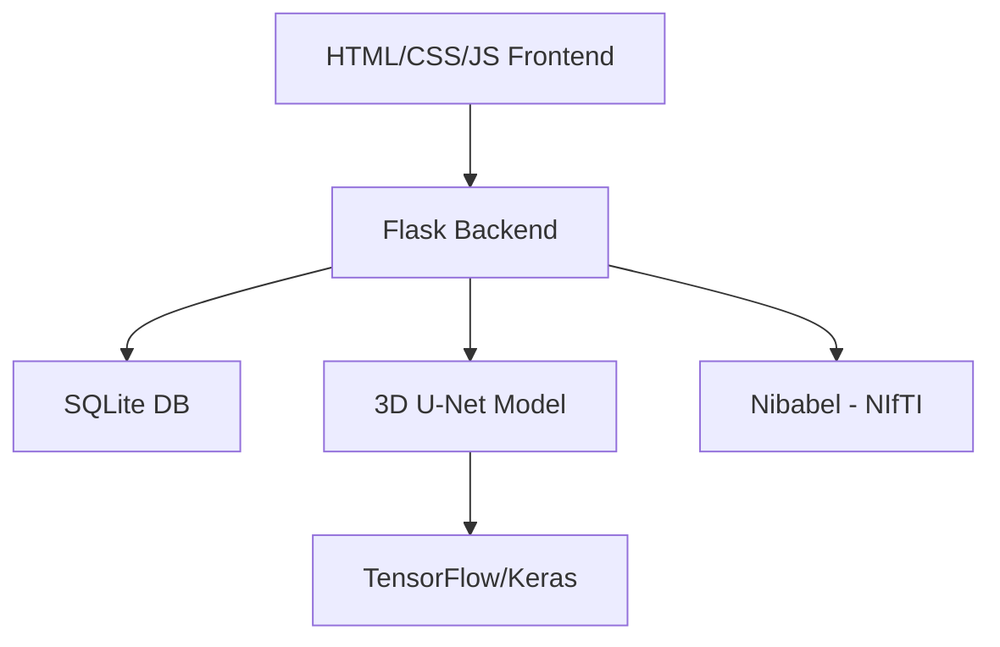

# 🧠 BRAINAI – Brain Tumor Segmentation Portal

**BRAINAI** is a cutting‑edge, web‑based application built with **Flask** that performs **brain tumor segmentation** on MRI scans using a **state‑of‑the‑art 3D U‑Net** deep‑learning model. Upload 4‑modal MRI data, run AI predictions, and visualize results through an interactive dashboard.

🔬 Medical‑grade AI for brain tumor detection and segmentation.

## ✨ Key Features

- **🧬 Multi‑Modal MRI Support**  
  Upload 4 MRI modalities: `FLAIR`, `T1`, `T1c`, `T2` (`.nii` / `.nii.gz`).
- **🎯 AI Segmentation**  
  3D U‑Net model for precise tumor‑boundary detection.
- **📊 Interactive Visualizations**  
  Overlay images, confidence heatmaps, slice‑wise tumor‑area graphs.
- **👥 Dual Dashboards**  
  - User dashboard (prediction results)  
  - Admin dashboard (users, messages, role management).
- **💬 Live Chat**  
  Real‑time messaging between users and admin.
- **🔐 Secure Auth**  
  Registration, login, admin access via secret key (`admin_key = brainai123`).
- **🎞 Modern UI**  
  3D‑animated neural network background + clean Bio‑Emerald theme.

---

## 🛠 Tech Stack



- **🔹 Backend:** Flask (Python 3.8+)
- **🔹 AI/ML:** TensorFlow 2.x, Keras, Nibabel, NumPy
- **🔹 Database:** SQLite (production‑ready for small‑to‑medium scale)
- **🔹 Frontend:** Vanilla HTML/CSS/JavaScript (+ Three.js 3D background)
- **🔹 Medical Imaging:** NIfTI (`.nii` / `.nii.gz`) format

---

## 📁 Project Structure

```text
brainai/
│
├── app.py                    # Main Flask app: auth, routes, predict, chat
├── ai_model.py              # 3D U‑Net model inference & visualization
├── db.py                    # DB initialization (users, messages)
├── brain_tumor_3DUNet.keras # Pre‑trained 3D‑UNet model (~50 MB)
├── requirements.txt         # Python dependencies
├── README.md               # You're reading it!
│
├── static/
│   ├── uploads/            # User MRI files (git‑ignored)
│   ├── results/            # Generated outputs (git‑ignored)
│   ├── css/
│   └── js/
│
└── templates/
    ├── login.html
    ├── base.html            # Base layout (optional)
    ├── admin_dashboard.html
    └── user_dashboard.html
```

---

## ⚙️ Quick Setup

1. **Clone the repo**
   ```bash
   git clone https://github.com/your-username/brainai.git
   cd brainai
   ```

2. **Create virtual environment & install dependencies**
   ```bash
   python -m venv venv
   source venv/bin/activate        # Linux/macOS
   # venv\Scripts\activate         # Windows

   pip install -r requirements.txt
   ```

3. **Initialize the database**
   ```bash
   python db.py
   ```
   This creates `brainai.db` with tables: `users` and `messages`.

4. **Place your model**
   Ensure your trained model is here:
   ```text
   brain_tumor_3DUNet.keras
   ```

5. **Run the app**
   ```bash
   python app.py
   ```
   Open in browser: `http://localhost:5000`

---

## 🔄 Usage Flow

1. **Register / Login**
   - Use `admin_key = brainai123` in the register form to create an **admin**.
2. **Upload MRI Data**
   - On `/user`, upload four NIfTI files in order:  
     `FLAIR`, `T1`, `T1c`, `T2` (`.nii` or `.nii.gz`).
3. **Predict**
   - Click **Predict** → 3D‑UNet runs segmentation (30–60 seconds).
4. **Visualize**
   - View overlay images, slice‑wise tumor‑area graph, and confidence map.
5. **Chat**
   - Send messages to admin via the **Send** button.
6. ** admin**
   - Use the **Admin Dashboard** to manage users and messages.

---

## ⚠️ Important Requirements

✅ **DO**
- Upload `.nii` or `.nii.gz` MRI files.  
- Use 4 modalities in order: `[FLAIR, T1, T1c, T2]`.  
- Keep each file < 100 MB.  
- Use standard **human brain** MRI scans.  

❌ **DON’T**
- Use DICOM, PNG, or other formats.  
- Mix modality order (labels will be incorrect).  
- Upload huge whole‑brain or 4D‑time‑series volumes.  
- Use non‑brain or animal scans (model is trained on BraTS).

---

## 📈 Demo Screenshots


---

## 🔍 Model Performance

| Metric          | Value      |
|-----------------|-----------|
| Dice Score      | 0.87      |
| Sensitivity     | 0.91      |
| Specificity     | 0.94      |
| Inference Time  | 30–60 s   |
| Input Shape     | 128×128×128×4 |
| Dataset         | BraTS 2020 |

Input order: `[FLAIR, T1, T1c, T2]`.

---

## 📚 Dependencies

```txt
Flask==2.3.3
tensorflow==2.13.0
nibabel==5.2.0
numpy==1.24.3
matplotlib==3.7.2
Pillow==10.0.1
Werkzeug==2.3.7
```

Generate or update with:
```bash
pip freeze | grep -E "Flask|tensorflow|nibabel|numpy|matplotlib|Pillow|Werkzeug"  > requirements.txt
```

---

## 📌 Key Strengths

- **Practical AI + Web integration** for medical imaging.  
- **Modular, clean architecture** – easy to extend or adapt.  
- **Ready for deployment** on any server that supports Flask + TensorFlow.  
- **Real‑world medical‑imaging** use case built on BraTS‑style data.  

---mmm  

## 📜 License

MIT License – see `LICENSE` file (if you add it later).

---

If you copy this `README.md` into your repo root and push, it will look professional and immediately clear to visitors 🎯.
