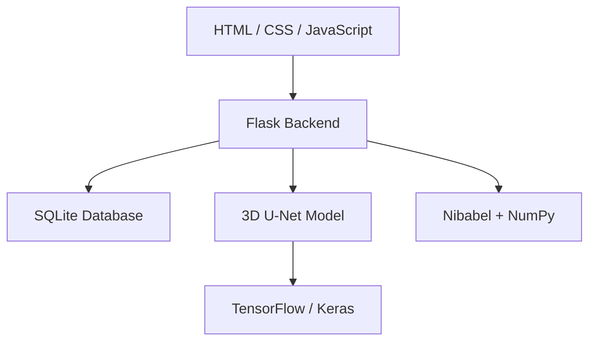

# BRAINAI – Brain Tumor Segmentation Portal

BRAINAI is a Flask-based brain tumor segmentation platform for multimodal MRI analysis. It uses a pretrained 3D U-Net model to analyze FLAIR, T1, T1c, and T2 MRI volumes and generate segmentation masks, overlay images, confidence maps, and slice-wise tumor activity graphs. The system also supports report sharing to doctors with timestamped activity tracking. [web:239][web:242][web:244]

## Overview

This application is designed for automated brain tumor segmentation and report generation in a web interface. Users can upload four MRI modalities in the correct order, run inference, review the results, and send the final report to a doctor. The admin dashboard provides user management, message monitoring, and report history. [web:239][web:242][web:244]

---

## Key Features

- Multimodal MRI support: FLAIR, T1, T1c, T2.
- AI-based tumor segmentation using a pretrained 3D U-Net model.
- Overlay visualization of predicted tumor regions.
- Slice-wise tumor area graph.
- Confidence heatmap for segmentation quality.
- Downloadable output mask and generated images.
- User dashboard for prediction and report submission.
- Admin dashboard for managing users, messages, and report records.
- Report history with doctor name, doctor email, status, and sent date/time.
- Secure login with role-based access. [web:238][web:242][web:244]

---

## Technology Stack



- Backend: Flask.
- AI/ML: TensorFlow, Keras, NumPy.
- Medical imaging: NiBabel, NIfTI files.
- Database: SQLite.
- Frontend: HTML, CSS, JavaScript.
- Visualization: Matplotlib-generated overlays and graphs. [web:239][web:244]

---

## Project Structure

```text
brainai/
├── app.py
├── ai_model.py
├── db.py
├── brain_tumor_3DUNet.keras
├── requirements.txt
├── README.md
├── static/
│   ├── uploads/
│   ├── results/
│   ├── css/
│   └── js/
└── templates/
    ├── login.html
    ├── base.html
    ├── admin_dashboard.html
    ├── user_dashboard.html
    └── activity.html
```

This structure keeps prediction, database logic, and templates separated, which makes the app easier to maintain and extend. [web:243][web:244]

---

## Setup Instructions

### 1. Clone the repository

```bash
git clone https://github.com/your-username/brainai.git
cd brainai
```

### 2. Create a virtual environment

```bash
python -m venv venv
```

Activate it:

```bash
# Linux / macOS
source venv/bin/activate

# Windows
venv\Scripts\activate
```

### 3. Install dependencies

```bash
pip install -r requirements.txt
```

### 4. Initialize the database

```bash
python db.py
```

This creates the required tables for users, messages, and reports. [web:243][web:244]

### 5. Add the trained model

Place your trained file here:

```text
brain_tumor_3DUNet.keras
```

### 6. Run the app

```bash
python app.py
```

Open:

```text
http://localhost:5000
```

---

## User Workflow

1. Register or log in.
2. Upload the four MRI files in this exact order:
   - FLAIR
   - T1
   - T1c
   - T2
3. Run the prediction.
4. Review segmentation overlays, confidence heatmap, and slice graph.
5. Enter doctor details and send the report.
6. View report status and sent timestamp in the dashboard history. [web:239][web:242][web:244]

---

## Admin Workflow

1. View registered users.
2. Approve or promote users.
3. Monitor messages.
4. Review recent report activity.
5. Check when each report was sent and to whom. [web:242][web:244]

---

## Report Tracking

Each report should store the following fields:

- Patient email.
- Doctor name.
- Doctor email.
- Prediction result.
- Confidence score.
- Tumor voxel count.
- Report status.
- Report sent date/time. [web:242][web:244]

A typical report entry should look like this:

```text
Patient: user@example.com
Doctor: Dr. Smith
Doctor Email: drsmith@hospital.com
Prediction: Tumor Detected
Confidence: 94.2%
Tumor Voxels: 125430
Status: Sent
Sent At: 2026-04-15 12:15 PM
```

---

## Database Tables

### Users

```sql
CREATE TABLE IF NOT EXISTS users (
    id INTEGER PRIMARY KEY AUTOINCREMENT,
    name TEXT NOT NULL,
    email TEXT UNIQUE NOT NULL,
    password TEXT NOT NULL,
    role TEXT NOT NULL DEFAULT 'user',
    approved INTEGER NOT NULL DEFAULT 0,
    created_at TIMESTAMP DEFAULT CURRENT_TIMESTAMP
);
```

### Messages

```sql
CREATE TABLE IF NOT EXISTS messages (
    id INTEGER PRIMARY KEY AUTOINCREMENT,
    sender TEXT NOT NULL,
    receiver TEXT NOT NULL,
    msg TEXT NOT NULL,
    created_at TIMESTAMP DEFAULT CURRENT_TIMESTAMP
);
```

### Reports

```sql
CREATE TABLE IF NOT EXISTS reports (
    id INTEGER PRIMARY KEY AUTOINCREMENT,
    patient_email TEXT NOT NULL,
    doctor_name TEXT NOT NULL,
    doctor_email TEXT NOT NULL,
    prediction TEXT,
    confidence TEXT,
    tumor_voxels INTEGER,
    report_status TEXT DEFAULT 'pending',
    report_sent_at TIMESTAMP,
    created_at TIMESTAMP DEFAULT CURRENT_TIMESTAMP
);
```

This makes the database more suitable for tracking clinical workflow and report history. [web:242][web:244]

---

## Report Submission Form

Use this in the user dashboard after prediction:

```html
<form action="{{ url_for('send_report') }}" method="POST">
  <input type="text" name="doctor_name" placeholder="Doctor Name" required>
  <input type="email" name="doctor_email" placeholder="Doctor Email" required>

  <input type="hidden" name="prediction" value="{{ result.prediction }}">
  <input type="hidden" name="confidence" value="{{ result.confidence }}">
  <input type="hidden" name="tumor_voxels" value="{{ result.tumor_voxels }}">

  <button type="submit">Send Report to Doctor</button>
</form>
```

This turns the dashboard into a usable report-sharing workflow rather than just a prediction screen. [web:242][web:244]

---

## Activity Page

Replace the placeholder activity card with a proper report history table:

```html
<h2>Report Activity</h2>


<table>
  <thead>
    <tr>
      <th>Patient</th>
      <th>Doctor</th>
      <th>Doctor Email</th>
      <th>Prediction</th>
      <th>Status</th>
      <th>Sent At</th>
    </tr>
  </thead>
  <tbody>
    
    <tr>
      <td>{{ r.patient_email }}</td>
      <td>{{ r.doctor_name }}</td>
      <td>{{ r.doctor_email }}</td>
      <td>{{ r.prediction }}</td>
      <td>{{ r.report_status }}</td>
      <td>{{ r.report_sent_at }}</td>
    </tr>
    
  </tbody>
</table>

<p>No reports have been sent yet.</p>

```

This is better than a placeholder because it provides an audit trail with dates and recipients. [web:238][web:242][web:244]

---

## Screenshot Labels

Use these cleaner labels in your README:

- Login Portal.
- Patient Upload Dashboard.
- Segmentation Result View.
- Confidence Heatmap.
- Slice-wise Tumor Activity Graph.
- Output Download Section.
- Patient Medical History.
- User Profile.
- Admin Dashboard.
- Report Activity Log. [web:242][web:244]

---

## Recommended Notes

- Keep the MRI order fixed: FLAIR, T1, T1c, T2.
- Accept only `.nii` and `.nii.gz` files.
- Save the report timestamp when sending to the doctor.
- Show sent vs pending status clearly.
- Use consistent medical terminology across the app. [web:239][web:242][web:244]

---

## License

MIT License.
