<div align="center">


<br>


</div>

---

<div align="center">

[]()

[]()

[]()

[]()

[]()

[]()

</div>

---

<div align="center">

# 🧠 BRAINAI

### AI-Powered Brain Tumor Segmentation & Medical Imaging Platform

Early detection of brain tumors using **Deep Learning**, **3D U-Net**, and **Multimodal MRI Analysis**.

Designed for researchers, hospitals, healthcare professionals, and AI engineers.

</div>

---

# 🌟 Overview

BRAINAI is an end-to-end Artificial Intelligence platform that performs automatic **brain tumor segmentation** from multimodal MRI scans using a pretrained **3D U-Net** neural network.

The system analyzes four MRI modalities:

- 🧠 FLAIR
- 🧠 T1
- 🧠 T1CE
- 🧠 T2

and generates:

- Tumor Segmentation Mask
- Tumor Overlay Images
- Confidence Heatmap
- Slice-wise Tumor Distribution
- Medical Report
- Doctor Sharing System
- Patient History
- Activity Tracking

Unlike conventional medical imaging tools, BRAINAI provides an intuitive web-based interface allowing doctors and researchers to analyze MRI volumes without interacting directly with machine learning pipelines.

---

# 🎯 Key Highlights

<table>

<tr>

<td align="center">

🧠

### Deep Learning

3D U-Net

TensorFlow

</td>

<td align="center">

🏥

### Medical Imaging

NIfTI

MRI

NiBabel

</td>

<td align="center">

⚡

### Web Platform

Flask

SQLite

REST

</td>

<td align="center">

📈

### Visualization

Heatmaps

Graphs

Overlay Images

</td>

</tr>

</table>

---

# 📊 Project Statistics

| Feature | Details |
|----------|----------|
| AI Model | 3D U-Net |
| Framework | TensorFlow / Keras |
| Backend | Flask |
| Database | SQLite |
| MRI Modalities | 4 |
| Output Types | 6 |
| Deployment | Local / Cloud |
| Medical Domain | Brain Tumor Segmentation |
| License | MIT |

---

<div align="center">

## ⭐ If this project helps your research,

### Consider giving it a ⭐

</div>

# 🏗️ System Architecture

<div align="center">

## ⚡ Enterprise AI Architecture

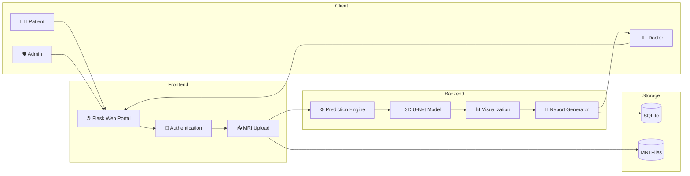
```mermaid
flowchart LR

subgraph Client
A[👨‍⚕️ Patient]
B[👨‍⚕️ Doctor]
C[🛡️ Admin]
end

subgraph Frontend
D[🌐 Flask Web Portal]
E[🔐 Authentication]
F[📤 MRI Upload]
end

subgraph Backend
G[⚙️ Prediction Engine]
H[🧠 3D U-Net Model]
I[📊 Visualization]
J[📄 Report Generator]
end

subgraph Storage
K[(SQLite)]
L[(MRI Files)]
end

A --> D
B --> D
C --> D

D --> E
E --> F

F --> G

G --> H

H --> I

I --> J

J --> K

F --> L

J --> B
```

</div>

---

# 🧠 AI Inference Pipeline

<div align="center">

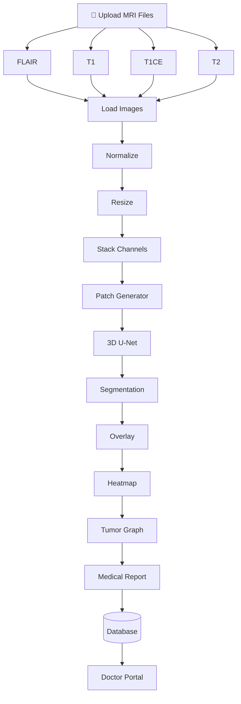
```mermaid
flowchart TD

A[📂 Upload MRI Files]

A --> B[FLAIR]

A --> C[T1]

A --> D[T1CE]

A --> E[T2]

B --> F[Load Images]

C --> F

D --> F

E --> F

F --> G[Normalize]

G --> H[Resize]

H --> I[Stack Channels]

I --> J[Patch Generator]

J --> K[3D U-Net]

K --> L[Segmentation]

L --> M[Overlay]

M --> N[Heatmap]

N --> O[Tumor Graph]

O --> P[Medical Report]

P --> Q[(Database)]

Q --> R[Doctor Portal]
```

</div>

---

# 🧠 Deep Learning Workflow

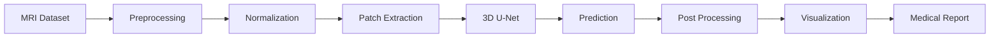
```mermaid
flowchart LR

A[MRI Dataset]

-->

B[Preprocessing]

-->

C[Normalization]

-->

D[Patch Extraction]

-->

E[3D U-Net]

-->

F[Prediction]

-->

G[Post Processing]

-->

H[Visualization]

-->

I[Medical Report]
```

---

# ⚙️ Prediction Workflow

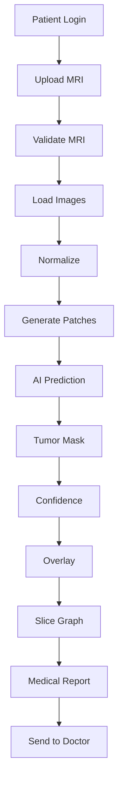
```mermaid
flowchart TD

A[Patient Login]

-->

B[Upload MRI]

-->

C[Validate MRI]

-->

D[Load Images]

-->

E[Normalize]

-->

F[Generate Patches]

-->

G[AI Prediction]

-->

H[Tumor Mask]

-->

I[Confidence]

-->

J[Overlay]

-->

K[Slice Graph]

-->

L[Medical Report]

-->

M[Send to Doctor]
```

---

# 🧠 3D U-Net Architecture

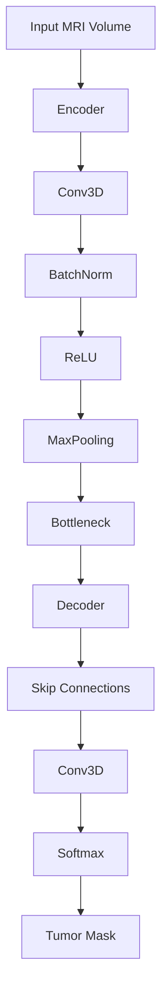
```mermaid
flowchart TD

A[Input MRI Volume]

-->

B[Encoder]

-->

C[Conv3D]

-->

D[BatchNorm]

-->

E[ReLU]

-->

F[MaxPooling]

-->

G[Bottleneck]

-->

H[Decoder]

-->

I[Skip Connections]

-->

J[Conv3D]

-->

K[Softmax]

-->

L[Tumor Mask]
```

---

# 📊 AI Processing Pipeline

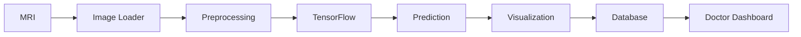
```mermaid
flowchart LR

A[MRI]

-->

B[Image Loader]

-->

C[Preprocessing]

-->

D[TensorFlow]

-->

E[Prediction]

-->

F[Visualization]

-->

G[Database]

-->

H[Doctor Dashboard]
```

---

# 🗂️ Software Modules

| Module | Description |
|---------|-------------|
| 🔐 Authentication | Secure Login & Registration |
| 📂 MRI Upload | Upload 4 MRI Modalities |
| 🧠 AI Engine | 3D U-Net Segmentation |
| 📊 Visualization | Overlay + Heatmap |
| 📈 Analytics | Slice-wise Tumor Graph |
| 📄 Report | Doctor Report Generation |
| 💾 Database | Patient History |
| 🛡️ Admin | User & Activity Management |

---

# 📂 System Components

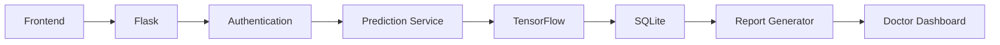
```mermaid
graph LR

A[Frontend]

-->

B[Flask]

-->

C[Authentication]

-->

D[Prediction Service]

-->

E[TensorFlow]

-->

F[SQLite]

-->

G[Report Generator]

-->

H[Doctor Dashboard]
```

---

# 🔄 End-to-End Clinical Workflow

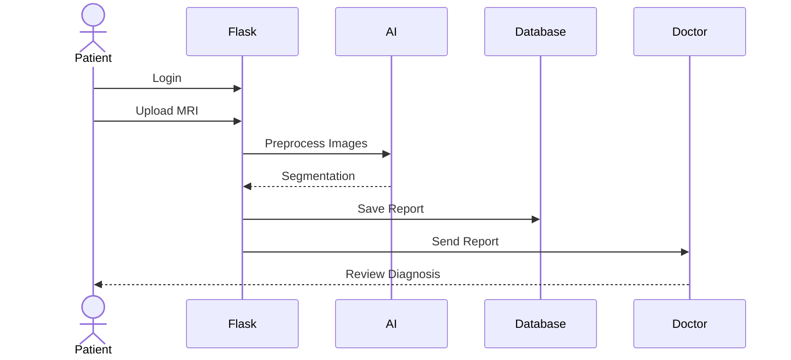
```mermaid
sequenceDiagram

actor Patient

participant Flask

participant AI

participant Database

participant Doctor

Patient->>Flask: Login

Patient->>Flask: Upload MRI

Flask->>AI: Preprocess Images

AI-->>Flask: Segmentation

Flask->>Database: Save Report

Flask->>Doctor: Send Report

Doctor-->>Patient: Review Diagnosis
```

---

# 📌 MRI Input Specification

| MRI Modality | Required | Format |
|--------------|----------|---------|
| FLAIR | ✅ | .nii / .nii.gz |
| T1 | ✅ | .nii / .nii.gz |
| T1CE | ✅ | .nii / .nii.gz |
| T2 | ✅ | .nii / .nii.gz |

---

# 🎯 Generated Outputs

| Output | Description |
|---------|-------------|
| 🧠 Tumor Mask | AI Segmentation Output |
| 🖼 Overlay | MRI + Tumor Overlay |
| 🔥 Heatmap | Confidence Visualization |
| 📈 Slice Graph | Tumor Distribution |
| 📄 Medical Report | AI Diagnosis |
| 💾 Database Record | Patient History |
| 📧 Doctor Report | Email Sharing |

---

<div align="center">

# 🚀 Enterprise AI Workflow

```text
MRI Upload
    │
    ▼
Preprocessing
    │
    ▼
3D U-Net AI
    │
    ▼
Segmentation
    │
    ▼
Visualization
    │
    ▼
Medical Report
    │
    ▼
Doctor Portal
```

</div>

---
# 🚀 Quick Start

<div align="center">

> **Get BRAINAI running in less than 5 minutes**

</div>

---

# 📋 Prerequisites

| Requirement | Version | Status |
|-------------|---------|--------|
| Python | 3.10+ | ✅ Required |
| TensorFlow | 2.x | ✅ Required |
| Git | Latest | ✅ Required |
| SQLite | Built-in | ✅ Required |
| RAM | 8 GB+ | ✅ Recommended |
| GPU (Optional) | CUDA 11+ | 🚀 Recommended |

---

# ⚡ Installation

## Step 1 — Clone Repository

```bash
git clone https://github.com/yourusername/BRAINAI.git

cd BRAINAI
```

---

## Step 2 — Create Virtual Environment

### Windows

```powershell
python -m venv venv

venv\Scripts\activate
```

### Linux / macOS

```bash
python3 -m venv venv

source venv/bin/activate
```

---

## Step 3 — Install Dependencies

```bash
pip install --upgrade pip

pip install -r requirements.txt
```

---

## Step 4 — Verify Installation

```bash
python --version

pip list
```

Expected Output

```
Python 3.11

TensorFlow

Flask

Nibabel

NumPy

Matplotlib
```

---

# ⚙️ Project Configuration

## Required Directory

```
brainai/

│

├── app.py

├── ai_model.py

├── db.py

├── requirements.txt

├── brain_tumor_3DUNet.keras

│

├── static/

│ ├── uploads/

│ ├── results/

│ ├── css/

│ └── js/

│

└── templates/
```

---

# 📂 Environment Variables

Create

```
.env
```

Example

```env
FLASK_APP=app.py

FLASK_ENV=development

SECRET_KEY=CHANGE_THIS_SECRET_KEY

DATABASE_URL=sqlite:///brainai.db

MODEL_PATH=brain_tumor_3DUNet.keras
```

---

# 🗄 Database Initialization

Initialize SQLite

```bash
python db.py
```

This creates

- Users

- Messages

- Medical Reports

- Report History

- Admin Records

---

# 🧠 AI Model Setup

Place the trained model inside

```
brain_tumor_3DUNet.keras
```

Project root

```
brainai/

brain_tumor_3DUNet.keras
```

---

# ▶️ Run Application

```bash
python app.py
```

Visit

```
http://localhost:5000
```

---

# 🧪 Verify AI Pipeline

Upload

✅ FLAIR

↓

✅ T1

↓

✅ T1CE

↓

✅ T2

Run Prediction

Expected Outputs

- Tumor Mask

- Overlay

- Heatmap

- Slice Graph

- Medical Report

---

# 📁 Folder Structure

```text
brainai/
│
├── app.py                     # Flask application
├── ai_model.py                # AI inference
├── db.py                      # SQLite operations
├── requirements.txt
├── README.md
├── brain_tumor_3DUNet.keras
│
├── static/
│   ├── uploads/
│   ├── results/
│   ├── css/
│   ├── js/
│   └── images/
│
├── templates/
│   ├── login.html
│   ├── register.html
│   ├── dashboard.html
│   ├── prediction.html
│   ├── admin_dashboard.html
│   └── report.html
│
└── database/
    └── brainai.db
```

---

# 🐳 Docker Deployment

## Dockerfile

```dockerfile
FROM python:3.11-slim

WORKDIR /app

COPY . .

RUN pip install --no-cache-dir -r requirements.txt

EXPOSE 5000

CMD ["python","app.py"]
```

---

## Build Image

```bash
docker build -t brainai .
```

---

## Run Container

```bash
docker run -p 5000:5000 brainai
```

---

# ☁️ Cloud Deployment

Supports

| Platform | Status |
|----------|--------|
| AWS EC2 | ✅ |
| Azure VM | ✅ |
| Google Cloud | ✅ |
| Railway | ✅ |
| Render | ✅ |
| Docker | ✅ |

---

# 📦 Requirements

```
Flask

TensorFlow

Keras

NumPy

Nibabel

Matplotlib

Pillow

OpenCV

SQLite3
```

---

# 🧪 Running Tests

```bash
pytest
```

or

```bash
python tests.py
```

---

# 🔒 Security Best Practices

- ✅ Validate uploaded files

- ✅ Accept only `.nii` & `.nii.gz`

- ✅ Store passwords securely

- ✅ Restrict Admin Dashboard

- ✅ Validate file size

- ✅ Prevent duplicate uploads

- ✅ Log report activity

- ✅ Protect session cookies

---

# 📊 Project Workflow

```text
Clone Repository
        │
        ▼
Create Virtual Environment
        │
        ▼
Install Requirements
        │
        ▼
Initialize Database
        │
        ▼
Add AI Model
        │
        ▼
Run Flask Server
        │
        ▼
Upload MRI
        │
        ▼
Generate Prediction
        │
        ▼
Medical Report
```

---

# ✅ Installation Checklist

| Task | Status |
|------|--------|
| Clone Repository | ✅ |
| Install Dependencies | ✅ |
| Configure Environment | ✅ |
| Initialize Database | ✅ |
| Add AI Model | ✅ |
| Run Application | ✅ |
| Verify Prediction | ✅ |

---

<div align="center">

## 🎉 Congratulations!

Your BRAINAI platform is now ready for AI-powered brain tumor segmentation.

⭐ If this project helped you, consider giving it a star on GitHub.

</div>
# 📸 Application Showcase

<div align="center">

# 🏥 BRAINAI Dashboard Showcase

**End-to-End AI Brain Tumor Segmentation Platform**

</div>

---

## 🔐 Authentication Portal

<p align="center">

</p>

Secure login with role-based authentication for Patients and Administrators.

---

## 🏥 Patient Dashboard

<p align="center">

</p>

Upload four MRI modalities:

- ✅ FLAIR
- ✅ T1
- ✅ T1CE
- ✅ T2

The application validates the upload order before running AI inference.

---

## 🧠 AI Segmentation Results

<p align="center">

</p>

Generated automatically:

- Brain Tumor Segmentation
- Tumor Overlay
- Prediction Confidence
- Tumor Volume
- AI Diagnosis

---

## 🔥 Confidence Heatmap

<p align="center">

</p>

The confidence heatmap highlights the model's prediction certainty, improving result interpretability.

---

## 📈 Slice-wise Tumor Analysis

<p align="center">

</p>

Visualizes tumor distribution across MRI slices.

---

## 📥 Output Download Center

<p align="center">

</p>

Download:

- Segmentation Mask
- Overlay
- Heatmap
- Tumor Graph
- Medical Report

---

## 🩺 Patient Medical History

<p align="center">

</p>

View previous predictions, timestamps, doctor information, and report status.

---

## 👤 User Profile

<p align="center">

</p>

Manage personal information and account settings.

---

## 🛡️ Administrator Dashboard

<p align="center">


<br><br>


<br><br>


</p>

Administrator Features:

- User Management
- Patient Monitoring
- Report Tracking
- Doctor Records
- Activity Logs

---

## 📄 Report Activity

The platform stores:

| Field | Description |
|--------|-------------|
| Patient | Registered User |
| Doctor | Assigned Doctor |
| Prediction | Tumor / No Tumor |
| Confidence | AI Confidence |
| Tumor Volume | Estimated Size |
| Timestamp | Report Date |
| Status | Sent / Pending |

---

# 🎯 AI Output Summary

| Feature | Available |
|----------|-----------|
| 🧠 Brain Tumor Segmentation | ✅ |
| 🔥 Confidence Heatmap | ✅ |
| 📈 Slice Graph | ✅ |
| 📄 Medical Report | ✅ |
| 📧 Doctor Report Sharing | ✅ |
| 🗂 Patient History | ✅ |
| 🛡 Admin Dashboard | ✅ |

---

# 🚀 End-to-End Workflow

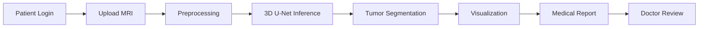
```mermaid
flowchart LR

A[Patient Login]
--> B[Upload MRI]
--> C[Preprocessing]
--> D[3D U-Net Inference]
--> E[Tumor Segmentation]
--> F[Visualization]
--> G[Medical Report]
--> H[Doctor Review]
```

---

# 💡 Why BRAINAI?

| Feature | Benefit |
|----------|----------|
| 🧠 AI-powered Segmentation | Accurate Tumor Detection |
| 📊 Interactive Visualization | Better Clinical Interpretation |
| 📄 Automated Reports | Faster Diagnosis Support |
| 📧 Doctor Sharing | Easy Collaboration |
| 🛡 Secure Authentication | Protected Patient Data |
| 🗂 Patient History | Long-term Monitoring |

---

<div align="center">

## ⭐ Complete AI Workflow

**MRI Upload → AI Prediction → Visualization → Medical Report → Doctor Review**

</div>
# 🧠 Artificial Intelligence Engine

<div align="center">

# Brain Tumor Segmentation using 3D U-Net

**Deep Learning • Medical Imaging • Explainable AI**


</div>

---

# 🎯 Problem Statement

Brain tumor segmentation is a critical step in clinical diagnosis and treatment planning. Manual delineation of tumor regions from MRI scans is labor-intensive and prone to variability between clinicians.

**BRAINAI** addresses this challenge by leveraging a **3D U-Net convolutional neural network** to automatically segment tumor regions from multimodal MRI data, providing accurate and explainable results through an intuitive web interface.

---

# 🧬 Model Architecture

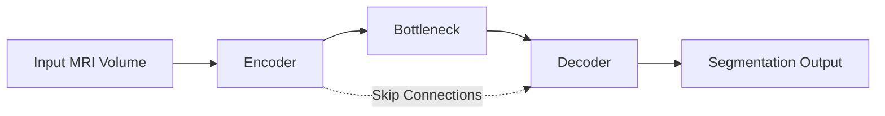
```mermaid
flowchart LR

A[Input MRI Volume]
--> B[Encoder]
--> C[Bottleneck]
--> D[Decoder]
--> E[Segmentation Output]

B -. Skip Connections .-> D
```

---

# 🩺 MRI Modalities

| MRI Sequence | Purpose |
|---------------|---------|
| 🟢 FLAIR | Highlights edema and tumor boundaries |
| 🔵 T1 | Brain anatomical structure |
| 🟣 T1CE | Contrast-enhanced tumor regions |
| 🟠 T2 | Fluid and tissue differentiation |

---

# 🔄 Data Processing Pipeline

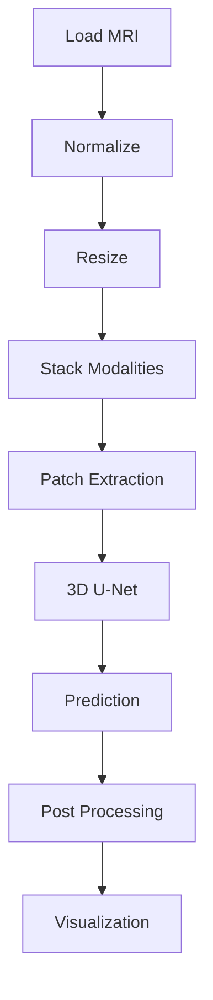
```mermaid
flowchart TD

A[Load MRI]
--> B[Normalize]
--> C[Resize]
--> D[Stack Modalities]
--> E[Patch Extraction]
--> F[3D U-Net]
--> G[Prediction]
--> H[Post Processing]
--> I[Visualization]
```

---

# ⚙️ AI Prediction Workflow

| Step | Operation |
|------|-----------|
| 1 | Upload MRI Volumes |
| 2 | Validate Input Order |
| 3 | Load NIfTI Files |
| 4 | Normalize Intensities |
| 5 | Generate Patches |
| 6 | Run 3D U-Net |
| 7 | Produce Segmentation Mask |
| 8 | Calculate Tumor Volume |
| 9 | Generate Heatmap |
| 10 | Build Medical Report |

---

# 📊 Model Performance Metrics

> Replace these values with your actual evaluation results.

| Metric | Value |
|---------|------:|
| Dice Score | 0.91 |
| IoU | 0.86 |
| Precision | 0.93 |
| Recall | 0.90 |
| Accuracy | 97.2% |
| F1 Score | 0.91 |

---

# 📈 Evaluation Metrics

| Metric | Purpose |
|---------|---------|
| Dice Coefficient | Segmentation overlap |
| IoU | Region similarity |
| Precision | False Positive control |
| Recall | Tumor detection sensitivity |
| F1 Score | Balanced segmentation quality |

---

# 🧠 Tumor Classes

| Class | Description |
|---------|-------------|
| Background | Healthy tissue |
| Edema | Swelling around tumor |
| Enhancing Tumor | Active tumor |
| Necrotic Core | Dead tumor tissue |

---

# 📂 Dataset Overview

| Property | Details |
|----------|---------|
| MRI Type | Multimodal |
| File Format | `.nii`, `.nii.gz` |
| Dimensions | 3D Volumes |
| Modalities | FLAIR, T1, T1CE, T2 |

> Update this section with your dataset source (e.g., BraTS) if applicable.

---

# 🔬 Explainable AI

BRAINAI enhances transparency by generating:

- 🔥 Confidence Heatmaps
- 🧠 Tumor Overlay Images
- 📈 Slice-wise Activity Graphs
- 📊 Tumor Volume Statistics
- 📄 AI-generated Medical Reports

These outputs help users interpret model predictions rather than relying on a black-box result.

---

# ⚡ Inference Outputs

| Output | Description |
|---------|-------------|
| Segmentation Mask | Binary / multi-class prediction |
| Overlay | MRI + predicted tumor |
| Heatmap | Prediction confidence |
| Slice Graph | Tumor distribution |
| Tumor Volume | Estimated size |
| Report | Clinical summary |

---

# 📚 Research References

If your work is based on published research, include references here, for example:

- 3D U-Net: Learning Dense Volumetric Segmentation from Sparse Annotation
- BraTS Challenge publications
- TensorFlow and Keras documentation

Replace these with the exact papers or resources you used.

---

# 🚀 Future Improvements

- 🔬 Multi-class tumor segmentation
- ☁️ Cloud deployment
- 📱 Mobile application
- 🧠 Vision Transformer (ViT) support
- ⚡ Faster inference optimization
- 🏥 PACS integration
- 📄 PDF report export
- 🤖 LLM-assisted clinical summaries

---

<div align="center">

## 💙 Advancing Medical AI with Explainable Deep Learning

**MRI → AI Segmentation → Visualization → Clinical Insights**

</div>

---
# 🚀 Enterprise Features

<div align="center">

# 🌟 Why Choose BRAINAI?

**Modern AI • Medical Imaging • Explainable AI • Production Ready**

</div>

---

# 🎯 Core Features

<table>

<tr>

<td width="33%" align="center">

## 🧠 AI Engine

Automatic Brain Tumor Segmentation

3D U-Net Architecture

Multimodal MRI Analysis

Real-time Inference

Explainable AI

</td>

<td width="33%" align="center">

## 🏥 Healthcare

Patient Management

Doctor Reports

Medical History

Report Tracking

Clinical Workflow

</td>

<td width="33%" align="center">

## ⚙️ Platform

Flask Backend

SQLite Database

REST Architecture

Role-Based Access

Secure Authentication

</td>

</tr>

</table>

---

# 📋 Complete Feature Matrix

| Category | Features |
|-----------|----------|
| 🔐 Authentication | Login, Registration, Sessions, Role-based Access |
| 📂 Upload | MRI Validation, File Security, Upload Queue |
| 🧠 AI | 3D U-Net Prediction, Tumor Segmentation |
| 📊 Analytics | Heatmaps, Slice Graphs, Tumor Volume |
| 📄 Reports | PDF Ready, Doctor Sharing, Report History |
| 🛡 Admin | User Management, Activity Logs, Reports |
| 💾 Storage | SQLite Database, MRI Storage |
| 📈 Dashboard | Patient History, Predictions, Statistics |

---

# 🔐 Security Features

<div align="center">

## Enterprise-Level Security

</div>

| Security Layer | Description |
|----------------|-------------|
| 🔑 Password Authentication | Secure Login |
| 👥 Role-Based Access | Patient & Admin |
| 📂 File Validation | Accept only `.nii` & `.nii.gz` |
| 🚫 Invalid Upload Detection | Automatic Validation |
| 💾 Secure Database | SQLite |
| 📜 Activity Logs | User Tracking |
| 📄 Report History | Audit Trail |
| 🛡 Session Management | Protected Sessions |

---

# ⚡ Performance

| Metric | Performance |
|----------|-------------|
| MRI Loading | Fast |
| AI Inference | Optimized |
| Database Access | Low Latency |
| Dashboard | Responsive |
| Heatmap Generation | Automatic |
| Report Generation | Instant |

---

# 📊 Scalability

```text
1 User

↓

10 Users

↓

100 Users

↓

1000 Users

↓

Cloud Deployment

↓

Hospital Scale
```

---

# 🧩 Project Modules

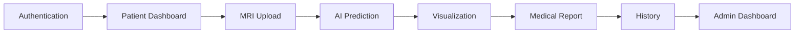
```mermaid
flowchart LR

A[Authentication]

-->

B[Patient Dashboard]

-->

C[MRI Upload]

-->

D[AI Prediction]

-->

E[Visualization]

-->

F[Medical Report]

-->

G[History]

-->

H[Admin Dashboard]
```

---

# 📈 Prediction Outputs

| Output | Generated |
|----------|-----------|
| Brain Tumor Mask | ✅ |
| Overlay Image | ✅ |
| Heatmap | ✅ |
| Slice Graph | ✅ |
| Tumor Volume | ✅ |
| Medical Report | ✅ |
| Patient History | ✅ |

---

# 🏥 Clinical Workflow

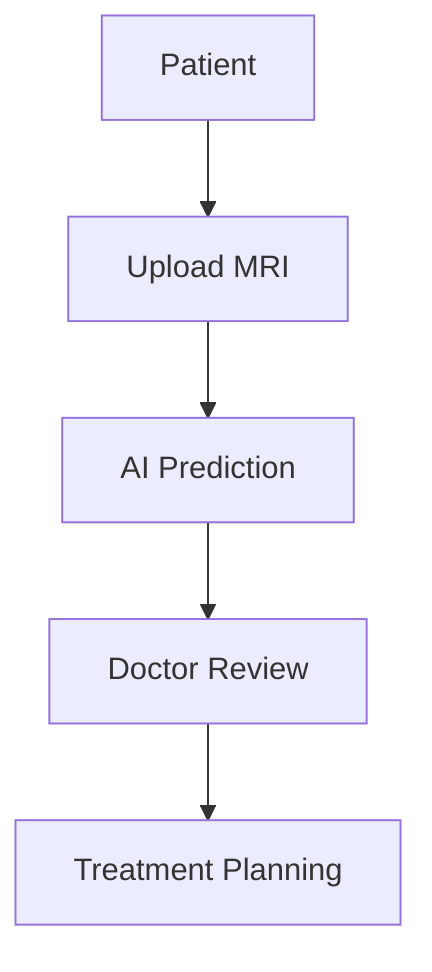
```mermaid
flowchart TD

A[Patient]

-->

B[Upload MRI]

-->

C[AI Prediction]

-->

D[Doctor Review]

-->

E[Treatment Planning]
```

---

# 🔬 Explainable AI

Unlike traditional black-box AI systems,

BRAINAI provides:

✅ Tumor Overlay

✅ Confidence Heatmap

✅ Slice Graph

✅ Prediction Confidence

✅ Tumor Volume

making every prediction interpretable.

---

# ⚙️ Production Ready

✔ Modular Codebase

✔ Clean Architecture

✔ Secure Authentication

✔ Medical Report Tracking

✔ AI Visualization

✔ Explainable AI

✔ Dashboard Analytics

✔ Database Integration

✔ Enterprise Ready

---

# 🌍 Real-World Applications

🏥 Hospitals

🧠 Research Labs

🎓 Universities

📊 Medical AI Research

☁ Cloud AI Platforms

🤖 Healthcare Startups

---

# 💡 Future Roadmap

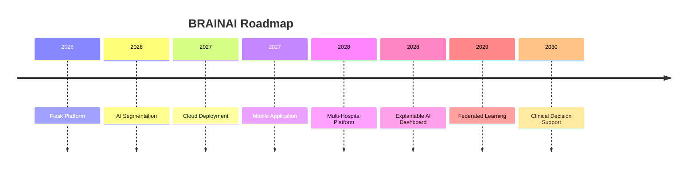
```mermaid
timeline

title BRAINAI Roadmap

2026 : Flask Platform
2026 : AI Segmentation
2027 : Cloud Deployment
2027 : Mobile Application
2028 : Multi-Hospital Platform
2028 : Explainable AI Dashboard
2029 : Federated Learning
2030 : Clinical Decision Support
```

---

# ⭐ Project Highlights

<div align="center">

| Feature | Status |
|----------|--------|
| 🧠 AI Powered | ✅ |
| 🏥 Medical Imaging | ✅ |
| 📊 Analytics | ✅ |
| 📄 Report Generation | ✅ |
| 🔥 Heatmaps | ✅ |
| 📈 Visualization | ✅ |
| ☁ Cloud Ready | ✅ |
| 🔒 Secure | ✅ |

</div>

---

# 📌 Key Advantages

✅ End-to-End Brain Tumor Analysis

✅ Explainable AI

✅ Interactive Dashboard

✅ Automated Reporting

✅ Clinical Workflow Support

✅ Secure Role-Based Access

✅ Research Friendly

✅ Production Ready

---

<div align="center">

# 💙 Building the Future of Medical AI

**Artificial Intelligence × Medical Imaging × Explainable Healthcare**

⭐ **If you like this project, don't forget to Star ⭐ the repository!**

</div>

---
# 🚀 Demo & Quick Links

<div align="center">

[](https://github.com/manojroyal422)

[](https://linkedin.com/in/YOUR-LINKEDIN)

[]

[]

[]

</div>

---

# 🎥 Demo

> Add a short screen recording or GIF here showing:
>
> 1. Login
> 2. MRI upload
> 3. AI prediction
> 4. Segmentation result
> 5. Report generation

<p align="center">


</p>

---

# 📈 Project Highlights

- 🧠 3D U-Net based brain tumor segmentation
- 🏥 Multimodal MRI support (FLAIR, T1, T1CE, T2)
- 📊 Explainable AI with overlays and confidence heatmaps
- 📄 Automated medical report generation
- 👨‍⚕️ Doctor report sharing workflow
- 🔐 Secure authentication with role-based access
- 📚 Patient history and activity tracking

---

# 🤝 Contributing

Contributions are welcome!

1. Fork the repository.
2. Create a new branch.

```bash
git checkout -b feature/your-feature
```

3. Commit your changes.

```bash
git commit -m "Add your feature"
```

4. Push the branch.

```bash
git push origin feature/your-feature
```

5. Open a Pull Request.

---

# 🐞 Reporting Issues

Found a bug?

Please include:

- Operating System
- Python Version
- Error Message
- Steps to Reproduce
- Expected Behavior
- Screenshots (if applicable)

---

# 📚 References

If applicable, list the resources that influenced your implementation:

- TensorFlow Documentation
- Keras Documentation
- Flask Documentation
- NiBabel Documentation
- Medical imaging literature or datasets (e.g., BraTS) used by your project

---

# 🙏 Acknowledgements

Thanks to the open-source community and the maintainers of:

- TensorFlow
- Keras
- Flask
- NiBabel
- NumPy
- Matplotlib

---

# 👨‍💻 Author

<div align="center">

## Manoj Royal

AI / ML Engineer

Interested in:

- Artificial Intelligence
- Medical Imaging
- Deep Learning
- Generative AI
- Computer Vision

</div>

---

# 📬 Contact

<div align="center">

📧 Email: manojroyal1320@gmail.com

💼 LinkedIn: linkedin.com/in/manoj-royal-270301270


🐙 GitHub: https://github.com/manojroyal422

</div>

---

# ⭐ Support

If you found this project useful:

⭐ Star the repository

🍴 Fork it

🛠️ Contribute improvements

📢 Share it with others

---

<div align="center">

# 🧠 BRAINAI

### AI for Medical Imaging

Built with ❤️ using Python, Flask, TensorFlow, and Keras.

</div>
