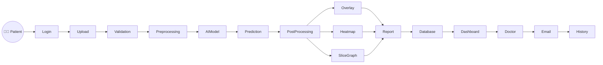
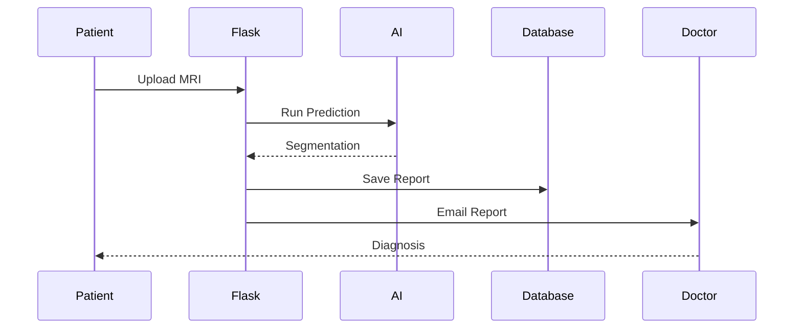

<div align="center">


<br>


</div>

---

<div align="center">

[]()

[]()

[]()

[]()

[]()

[]()

</div>

---

<div align="center">

# 🧠 BRAINAI

### AI-Powered Brain Tumor Segmentation & Medical Imaging Platform

Early detection of brain tumors using **Deep Learning**, **3D U-Net**, and **Multimodal MRI Analysis**.

Designed for researchers, hospitals, healthcare professionals, and AI engineers.

</div>

---

# 🌟 Overview

BRAINAI is an end-to-end Artificial Intelligence platform that performs automatic **brain tumor segmentation** from multimodal MRI scans using a pretrained **3D U-Net** neural network.

The system analyzes four MRI modalities:

- 🧠 FLAIR
- 🧠 T1
- 🧠 T1CE
- 🧠 T2

and generates:

- Tumor Segmentation Mask
- Tumor Overlay Images
- Confidence Heatmap
- Slice-wise Tumor Distribution
- Medical Report
- Doctor Sharing System
- Patient History
- Activity Tracking

Unlike conventional medical imaging tools, BRAINAI provides an intuitive web-based interface allowing doctors and researchers to analyze MRI volumes without interacting directly with machine learning pipelines.

---

# 🎯 Key Highlights

<table>

<tr>

<td align="center">

🧠

### Deep Learning

3D U-Net

TensorFlow

</td>

<td align="center">

🏥

### Medical Imaging

NIfTI

MRI

NiBabel

</td>

<td align="center">

⚡

### Web Platform

Flask

SQLite

REST

</td>

<td align="center">

📈

### Visualization

Heatmaps

Graphs

Overlay Images

</td>

</tr>

</table>

---

# 📊 Project Statistics

| Feature | Details |
|----------|----------|
| AI Model | 3D U-Net |
| Framework | TensorFlow / Keras |
| Backend | Flask |
| Database | SQLite |
| MRI Modalities | 4 |
| Output Types | 6 |
| Deployment | Local / Cloud |
| Medical Domain | Brain Tumor Segmentation |
| License | MIT |

---

<div align="center">

## ⭐ If this project helps your research,

### Consider giving it a ⭐

</div>

---
# 🏗️ System Architecture

<div align="center">

## BRAINAI Architecture Overview


```mermaid
flowchart LR

User((👨‍⚕️ Patient))

User --> Login

Login --> Upload

Upload --> Validation

Validation --> Preprocessing

Preprocessing --> AIModel

AIModel --> Prediction

Prediction --> PostProcessing

PostProcessing --> Overlay

PostProcessing --> Heatmap

PostProcessing --> SliceGraph

Overlay --> Report

Heatmap --> Report

SliceGraph --> Report

Report --> Database

Database --> Dashboard

Dashboard --> Doctor

Doctor --> Email

Email --> History
```

</div>

---

# 🧠 AI Inference Pipeline

```mermaid
graph TD

A[Upload MRI Files]

A --> B[FLAIR]

A --> C[T1]

A --> D[T1CE]

A --> E[T2]

B --> F

C --> F

D --> F

E --> F

F[Load NIfTI Images]

↓

Normalize

↓

Resize

↓

Stack 4 Channels

↓

Patch Extraction

↓

3D U-Net

↓

Tumor Prediction

↓

Voxel Classification

↓

Segmentation Mask

↓

Overlay Generation

↓

Confidence Heatmap

↓

Slice Analysis

↓

Medical Report
```

---

# 🔬 Deep Learning Workflow

<div align="center">

| Stage | Description |
|---------|-------------|
| MRI Acquisition | Four MRI Modalities |
| Data Loading | NiBabel |
| Preprocessing | Normalization |
| Patch Extraction | 128×128×128 |
| AI Model | 3D U-Net |
| Prediction | Multi-class Segmentation |
| Post Processing | Overlay + Statistics |
| Report Generation | PDF + Images |

</div>

---

# ⚙️ Prediction Workflow

```text

Patient Upload

↓

Validate MRI Order

↓

Load MRI Volumes

↓

Convert to NumPy Arrays

↓

Normalize Intensity

↓

Stack Modalities

↓

Patch Generation

↓

Run 3D U-Net

↓

Generate Tumor Mask

↓

Compute Tumor Volume

↓

Generate Confidence Heatmap

↓

Generate Slice-wise Graph

↓

Create Medical Report

↓

Store History

↓

Send to Doctor
```

---

# 🧠 3D U-Net Architecture

```text

Input Volume

(4 MRI Channels)

↓

Encoder

↓

Conv3D

↓

BatchNorm

↓

ReLU

↓

MaxPool

↓

Bottleneck

↓

Decoder

↓

Skip Connections

↓

Conv3D

↓

Segmentation Layer

↓

Softmax

↓

Tumor Classes
```

---

# 📊 AI Processing Pipeline

```mermaid

flowchart TD

MRI

↓

Image Loading

↓

Preprocessing

↓

Data Normalization

↓

Patch Generator

↓

3D U-Net

↓

Prediction

↓

Post Processing

↓

Visualization

↓

Medical Report

↓

Database Storage

↓

Doctor Portal
```

---

# 🗂️ Component Architecture

```mermaid

graph TB

Frontend

↓

Flask

↓

Authentication

↓

Prediction Service

↓

AI Engine

↓

TensorFlow

↓

SQLite

↓

Doctor Portal
```

---

# 🧩 Software Modules

| Module | Responsibility |
|----------|----------------|
| Authentication | Login & Registration |
| Upload Manager | MRI Upload |
| AI Engine | 3D U-Net Prediction |
| Visualization | Overlay + Heatmap |
| Analytics | Slice Graph |
| Report Module | PDF & Doctor Sharing |
| Database | Patient History |
| Admin Dashboard | User Management |

---

# 🔄 End-to-End Workflow


```mermaid
sequenceDiagram

participant Patient

participant Flask

participant AI

participant Database

participant Doctor

Patient->>Flask: Upload MRI

Flask->>AI: Run Prediction

AI-->>Flask: Segmentation

Flask->>Database: Save Report

Flask->>Doctor: Email Report

Doctor-->>Patient: Diagnosis
```

---

# 📌 MRI Input Requirements

| MRI | Required | Format |
|------|----------|---------|
| FLAIR | ✅ | .nii |
| T1 | ✅ | .nii |
| T1CE | ✅ | .nii |
| T2 | ✅ | .nii |

---

# 🎯 Output Generated

✅ Segmentation Mask

✅ Tumor Overlay

✅ Confidence Heatmap

✅ Slice-wise Tumor Graph

✅ Tumor Volume

✅ Prediction Confidence

✅ Medical Report

✅ Report History

---

<div align="center">

## ⚡ Enterprise AI Pipeline

Medical Imaging → Deep Learning → Explainable AI → Clinical Report

</div>

---
