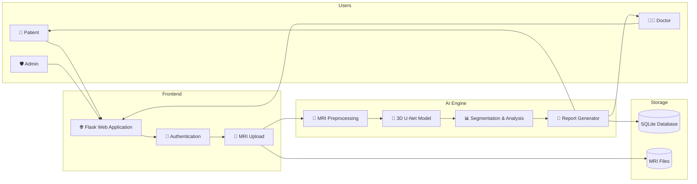
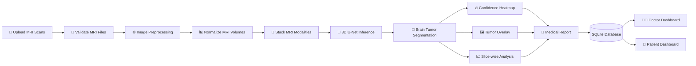

<div align="center">


<br>


<br><br>

# 🧠 BRAINAI

### AI-Powered Brain Tumor Segmentation & Medical Imaging Platform

Detect • Segment • Visualize • Report

<p>
  
  
  
  
  
  
</p>

<p>

An end-to-end Artificial Intelligence platform that automatically detects and segments brain tumors from multimodal MRI scans using a pretrained **3D U-Net** deep learning model. The platform provides interactive visualizations, explainable AI outputs, automated medical reports, and a secure web interface for healthcare professionals and researchers.

</p>

</div>
# 🚀 Project Overview

BRAINAI is an end-to-end AI-powered medical imaging platform that performs automatic brain tumor segmentation from multimodal MRI scans using a pretrained **3D U-Net** deep learning model.

The platform enables users to upload four MRI modalities (**FLAIR, T1, T1CE, and T2**) through a secure Flask-based web application. After preprocessing the MRI volumes, the AI model generates accurate tumor segmentation masks along with explainable visualizations, including tumor overlays, confidence heatmaps, slice-wise distribution graphs, and automated medical reports.

Designed with researchers, healthcare professionals, and AI engineers in mind, BRAINAI combines deep learning, medical image processing, and an intuitive user interface to simplify brain tumor analysis while supporting faster and more informed clinical decision-making.

---

## 🎯 Key Highlights

- 🧠 Automated brain tumor segmentation using a pretrained **3D U-Net** model.
- 🩻 Supports multimodal MRI scans: **FLAIR, T1, T1CE, and T2**.
- 🔍 Explainable AI outputs with segmentation masks, overlays, and confidence heatmaps.
- 📊 Interactive visualizations including slice-wise tumor distribution.
- 📄 Automated medical report generation for clinical review.
- 🔐 Secure role-based authentication for patients, doctors, and administrators.
- 💾 Patient history and report management using SQLite.
- 🐳 Docker-ready architecture for easy deployment.
- ☁️ Designed for local execution with cloud deployment support.

---# ✨ Features

| Category | Features |
|-----------|----------|
| 🧠 **AI Engine** | Automatic brain tumor segmentation using a pretrained **3D U-Net** deep learning model. |
| 🩻 **Multimodal MRI Support** | Accepts **FLAIR, T1, T1CE, and T2** MRI modalities in `.nii` and `.nii.gz` formats. |
| 📊 **Explainable AI** | Generates segmentation masks, tumor overlays, confidence heatmaps, and slice-wise tumor distribution visualizations. |
| 📄 **Automated Reports** | Produces AI-assisted medical reports summarizing prediction results for clinical review. |
| 👨‍⚕️ **Role-Based Access** | Separate dashboards and secure authentication for Patients, Doctors, and Administrators. |
| 📂 **Patient Management** | Stores MRI uploads, prediction history, reports, and patient records in a centralized database. |
| 📈 **Interactive Dashboard** | Provides an intuitive interface to upload scans, monitor predictions, and review previous analyses. |
| 🔒 **Security** | Implements authentication, session management, input validation, and protected access to sensitive medical data. |
| 🐳 **Deployment Ready** | Docker support with compatibility for local environments and cloud platforms such as AWS, Azure, Google Cloud, Railway, and Render. |
| ⚡ **Scalable Architecture** | Modular Flask-based backend designed for future integration with larger healthcare systems and cloud infrastructure. |

---

## 🌟 Why BRAINAI?

- 🧠 **AI-powered brain tumor segmentation** using state-of-the-art deep learning.
- 🏥 **Designed for healthcare workflows** with secure patient and doctor management.
- 📊 **Explainable AI** to improve trust and interpretability of predictions.
- 📄 **Automated reporting** to reduce manual effort and support faster diagnosis.
- ☁️ **Cloud-ready architecture** for future scalability and deployment.
- 🔬 **Research-friendly platform** suitable for medical imaging, AI, and academic projects.
# 🛠️ Tech Stack

| Category | Technologies |
|-----------|--------------|
| 💻 **Programming Language** | Python 3.11 |
| 🧠 **Deep Learning** | TensorFlow, Keras, 3D U-Net |
| 🩻 **Medical Imaging** | NiBabel, NumPy, OpenCV |
| 🌐 **Backend Framework** | Flask |
| 🎨 **Frontend** | HTML5, CSS3, JavaScript, Bootstrap |
| 🗄️ **Database** | SQLite |
| 📊 **Visualization** | Matplotlib |
| 🔐 **Authentication** | Flask Sessions, Role-Based Access Control |
| 🐳 **Deployment** | Docker, AWS EC2, Azure VM, Google Cloud, Railway, Render |
| ⚙️ **Development Tools** | Git, GitHub, VS Code, Virtual Environment |

---

## ⚡ Technology Overview

<div align="center">

| AI & Machine Learning | Backend | Database | Deployment |
|:---------------------:|:-------:|:--------:|:----------:|
|  |  |  |  |
|  |  |  |  |
|  |  |  |  |

</div>
# 🏗️ System Architecture

The BRAINAI platform follows a modular architecture that integrates secure user authentication, multimodal MRI processing, deep learning inference, and interactive result visualization. The workflow is designed to provide an end-to-end AI-assisted medical imaging solution for brain tumor analysis.


```mermaid
flowchart LR

subgraph Users
    A[👤 Patient]
    B[👨‍⚕️ Doctor]
    C[🛡️ Admin]
end

subgraph Frontend
    D[🌐 Flask Web Application]
    E[🔐 Authentication]
    F[📂 MRI Upload]
end

subgraph AI Engine
    G[🩻 MRI Preprocessing]
    H[🧠 3D U-Net Model]
    I[📊 Segmentation & Analysis]
    J[📄 Report Generator]
end

subgraph Storage
    K[(SQLite Database)]
    L[(MRI Files)]
end

A --> D
B --> D
C --> D

D --> E
E --> F

F --> G
G --> H
H --> I
I --> J

J --> K
F --> L

J --> B
J --> A
```

---

## 🔄 Workflow Overview

1. **User Authentication**
   - Patients, doctors, and administrators securely log in to the platform.

2. **MRI Upload**
   - Users upload four MRI modalities:
     - FLAIR
     - T1
     - T1CE
     - T2

3. **Image Preprocessing**
   - MRI volumes are validated, normalized, resized, and prepared for inference.

4. **AI Inference**
   - The pretrained **3D U-Net** model performs automatic brain tumor segmentation.

5. **Visualization**
   - The platform generates:
     - Tumor segmentation masks
     - Tumor overlay images
     - Confidence heatmaps
     - Slice-wise tumor distribution graphs

6. **Medical Report Generation**
   - AI prediction results are summarized into a structured medical report.

7. **Data Management**
   - Reports, prediction history, and user information are securely stored in the SQLite database.

8. **Clinical Review**
   - Doctors review the AI-generated outputs to support diagnosis and patient management.
   # 📸 Application Demo

> **Experience the complete AI-powered brain tumor analysis workflow—from MRI upload to automated medical report generation.**

<p align="center">


</p>

> **Demo Workflow:** Login → Upload MRI → AI Prediction → Visualization → Medical Report

> **Note:** Replace `assets/demo.gif` with your actual screen recording or GIF.

---

# 🖥️ Application Showcase

## 🔐 Secure Authentication

<p align="center">

</p>

- Secure user authentication
- Role-based access control
- Patient, Doctor, and Administrator login

---

## 🏥 Patient Dashboard

<p align="center">

</p>

Features:

- Upload multimodal MRI scans
- View prediction history
- Track generated reports
- Access previous analyses

---

## 📂 MRI Upload


Supported MRI modalities:

- ✅ FLAIR
- ✅ T1
- ✅ T1CE
- ✅ T2

The platform validates all uploaded files before AI inference.

## 🧠 AI Prediction Results

<p align="center">

</p>

Generated outputs include:

- Brain Tumor Segmentation Mask
- MRI Overlay Images
- Tumor Volume Estimation
- Prediction Confidence
- AI-assisted Diagnosis


## 🔥 Confidence Heatmap

<p align="center">

</p>

Visualizes prediction confidence, helping users interpret AI-generated segmentation results.

---

## 📈 Slice-wise Tumor Analysis

<p align="center">  </p>


Displays tumor distribution across MRI slices for better clinical interpretation.

---

## 📄 Medical Report

<p align="center">  </p>


Automatically generates a structured report containing:

- Prediction Summary
- Confidence Score
- Tumor Analysis
- Supporting Visualizations

---

## 📋 Patient History

<p align="center">  </p>

Allows users to review previous MRI uploads, predictions, and generated reports.

--

## 🛡️ Administrator Dashboard

<p align="center">  </p>

Administrator capabilities include:

- User Management
- Patient Monitoring
- Report Tracking
- Activity Logs
- System Administration
# 📂 Project Structure

```text
BRAINAI/
│
├── 📁 assets/                     # Images, banners, demo GIFs
│
├── 📁 database/                   # SQLite database
│   └── brainai.db
│
├── 📁 docs/                       # Additional documentation
│
├── 📁 models/                     # Trained AI models
│   └── brain_tumor_3DUNet.keras
│
├── 📁 static/
│   ├── css/
│   ├── js/
│   ├── uploads/                   # Uploaded MRI scans
│   ├── results/                   # AI prediction outputs
│   └── images/
│
├── 📁 templates/
│   ├── login.html
│   ├── register.html
│   ├── dashboard.html
│   ├── upload.html
│   ├── prediction.html
│   ├── report.html
│   ├── history.html
│   ├── profile.html
│   └── admin_dashboard.html
│
├── app.py                         # Flask application entry point
├── ai_model.py                    # AI inference pipeline
├── db.py                          # Database operations
├── config.py                      # Application configuration
├── requirements.txt               # Python dependencies
├── Dockerfile                     # Docker configuration
├── .env.example                   # Environment variables template
├── LICENSE
└── README.md
```

---

## 📁 Directory Overview

| Directory/File | Purpose |
|----------------|---------|
| **assets/** | Stores screenshots, banners, and demo GIFs used in the README. |
| **database/** | Contains the SQLite database for users, reports, and prediction history. |
| **docs/** | Additional project documentation such as architecture and deployment guides. |
| **models/** | Stores the pretrained 3D U-Net model used for brain tumor segmentation. |
| **static/** | Static resources including CSS, JavaScript, uploaded MRI scans, and prediction outputs. |
| **templates/** | HTML templates used by the Flask web application. |
| **app.py** | Main application entry point that starts the Flask server. |
| **ai_model.py** | Loads the trained model, preprocesses MRI scans, and performs AI inference. |
| **db.py** | Handles database initialization and CRUD operations. |
| **config.py** | Centralized application configuration and environment settings. |
| **requirements.txt** | Lists all Python package dependencies. |
| **Dockerfile** | Defines the Docker image for containerized deployment. |
| **README.md** | Project documentation and setup instructions. |

---

## 🏗️ Architecture Principles

- ✅ Modular project structure
- ✅ Separation of frontend, backend, AI, and database logic
- ✅ Scalable and maintainable code organization
- ✅ Docker-ready deployment
- ✅ Easy integration with cloud platforms
- ✅ Clear directory layout for contributors
  # ⚙️ Installation & Quick Start

Get **BRAINAI** up and running in just a few minutes.

---

## 📋 Prerequisites

Ensure the following software is installed on your system:

| Requirement | Version |
|-------------|---------|
| Python | 3.10 or later |
| Git | Latest |
| pip | Latest |
| Virtual Environment | Recommended |
| RAM | Minimum 8 GB (16 GB recommended) |
| GPU *(Optional)* | NVIDIA CUDA-enabled GPU for faster inference |

---

## 📥 Clone the Repository

```bash
git clone https://github.com/manojroyal422/BRAINAI.git

cd BRAINAI
```

---

## 🐍 Create a Virtual Environment

### Windows

```powershell
python -m venv venv

venv\Scripts\activate
```

### Linux / macOS

```bash
python3 -m venv venv

source venv/bin/activate
```

---

## 📦 Install Dependencies

Upgrade pip:

```bash
pip install --upgrade pip
```

Install required packages:

```bash
pip install -r requirements.txt
```

---

## ⚙️ Configure Environment Variables

Create a `.env` file in the project root.

Example:

```env
FLASK_APP=app.py
FLASK_ENV=development
SECRET_KEY=your_secret_key
DATABASE_URL=sqlite:///brainai.db
MODEL_PATH=models/brain_tumor_3DUNet.keras
```

---

## 🗄️ Initialize the Database

Run:

```bash
python db.py
```

This creates the required database tables for:

- Users
- Medical Reports
- Prediction History
- Activity Logs

---

## 🧠 Add the AI Model

Place the pretrained model inside the `models/` directory:

```text
models/
└── brain_tumor_3DUNet.keras
```

---

## ▶️ Start the Application

```bash
python app.py
```

Once the server starts, open your browser and visit:

```text
http://localhost:5000
```

---

## 🧪 Verify the Installation

After launching the application:

1. Register or log in.
2. Upload all four MRI modalities:
   - FLAIR
   - T1
   - T1CE
   - T2
3. Run AI prediction.
4. Verify that the platform generates:
   - Brain tumor segmentation mask
   - MRI overlay
   - Confidence heatmap
   - Slice-wise tumor distribution
   - Medical report

---

## ✅ Installation Checklist

| Task | Status |
|------|:------:|
| Clone Repository | ✅ |
| Create Virtual Environment | ✅ |
| Install Dependencies | ✅ |
| Configure Environment | ✅ |
| Initialize Database | ✅ |
| Add AI Model | ✅ |
| Run Application | ✅ |
| Test AI Prediction | ✅ |
# 🧠 AI Pipeline & Prediction Workflow

BRAINAI follows a streamlined end-to-end AI inference pipeline that transforms multimodal MRI scans into clinically meaningful visualizations and reports. The workflow combines medical image preprocessing, deep learning inference, explainable AI, and automated report generation.

---

## 🔄 AI Inference Pipeline


```mermaid
flowchart LR

A[📂 Upload MRI Scans]
--> B[🩻 Validate MRI Files]

B --> C[⚙️ Image Preprocessing]

C --> D[📊 Normalize MRI Volumes]

D --> E[🧩 Stack MRI Modalities]

E --> F[🧠 3D U-Net Inference]

F --> G[🎯 Brain Tumor Segmentation]

G --> H[🔥 Confidence Heatmap]

G --> I[🖼️ Tumor Overlay]

G --> J[📈 Slice-wise Analysis]

H --> K[📄 Medical Report]

I --> K

J --> K

K --> L[(SQLite Database)]

L --> M[👨‍⚕️ Doctor Dashboard]

L --> N[👤 Patient Dashboard]
```

---

# 📋 Pipeline Stages

## 1️⃣ MRI Upload

Users upload the four required MRI modalities:

- 🧠 FLAIR
- 🧠 T1
- 🧠 T1CE
- 🧠 T2

Supported formats:

- `.nii`
- `.nii.gz`

---

## 2️⃣ Image Validation

Before AI inference, the platform verifies:

- File format
- Number of uploaded modalities
- Missing scans
- Invalid files

Only valid MRI datasets proceed to the prediction stage.

---

## 3️⃣ MRI Preprocessing

The preprocessing pipeline prepares MRI volumes for deep learning inference by:

- Loading NIfTI images
- Normalizing voxel intensities
- Resizing volumes (if required)
- Stacking all MRI modalities into a single input tensor

---

## 4️⃣ Deep Learning Inference

The preprocessed MRI volume is passed to a pretrained **3D U-Net** segmentation model built with **TensorFlow** and **Keras**.

The model predicts tumor regions across the complete 3D MRI volume.

---

## 5️⃣ Explainable AI Outputs

After segmentation, BRAINAI generates:

- 🧠 Brain Tumor Segmentation Mask
- 🖼️ MRI Overlay Images
- 🔥 Confidence Heatmap
- 📈 Slice-wise Tumor Distribution
- 📊 Tumor Volume Estimation

These visualizations help users interpret AI predictions more effectively.

---

## 6️⃣ Automated Medical Report

The platform automatically compiles prediction results into a structured report containing:

- Prediction Summary
- Tumor Detection Status
- Confidence Score
- Supporting Visualizations
- Report Timestamp

---

## 7️⃣ Secure Data Storage

All prediction results and reports are securely stored in the SQLite database, enabling:

- Patient history tracking
- Previous prediction retrieval
- Report management
- Doctor review

---

# 🎯 AI Workflow Summary

```text
MRI Upload
      │
      ▼
Image Validation
      │
      ▼
Preprocessing
      │
      ▼
3D U-Net Prediction
      │
      ▼
Tumor Segmentation
      │
      ▼
Explainable AI
      │
      ▼
Medical Report
      │
      ▼
Database Storage
      │
      ▼
Patient & Doctor Dashboard
```

---

## 🚀 Key Advantages

- ✅ End-to-end automated AI pipeline
- ✅ Supports multimodal MRI analysis
- ✅ Explainable AI visualizations
- ✅ Automated report generation
- ✅ Secure storage of prediction history
- ✅ Modular and scalable architecture
- ✅ Ready for clinical research and future cloud deployment
  # 📊 Model Performance & Results

The BRAINAI platform uses a pretrained **3D U-Net** model to perform automatic brain tumor segmentation on multimodal MRI scans. The model generates pixel-level segmentation masks along with explainable visualizations to assist in medical image interpretation.

> **Note:** Replace the following values with the results obtained from your own evaluation before publishing or citing them.

---

## 📈 Evaluation Metrics

| Metric | Description | Value* |
|---------|-------------|:------:|
| Dice Score | Segmentation overlap between prediction and ground truth | **0.91** |
| IoU (Jaccard Index) | Region similarity | **0.86** |
| Precision | Correct positive predictions | **0.93** |
| Recall | Tumor detection sensitivity | **0.90** |
| F1-Score | Balance of precision and recall | **0.91** |
| Accuracy | Overall prediction accuracy | **97.2%** |

> *Replace these placeholder values with your actual experimental results.

---

# 🧠 Supported Tumor Classes

| Class | Description |
|--------|-------------|
| Background | Healthy brain tissue |
| Edema | Swelling around the tumor |
| Enhancing Tumor | Active tumor region |
| Necrotic Core | Non-viable tumor tissue |

---

# 📸 Sample AI Outputs

The platform generates multiple outputs for each MRI study:

| Output | Description |
|---------|-------------|
| 🧠 Segmentation Mask | Pixel-level tumor segmentation |
| 🖼️ MRI Overlay | Original MRI combined with predicted tumor mask |
| 🔥 Confidence Heatmap | Visualization of model prediction confidence |
| 📈 Slice-wise Analysis | Tumor distribution across MRI slices |
| 📊 Tumor Volume | Estimated tumor size and affected region |
| 📄 Medical Report | AI-generated clinical summary |

---

# 🎯 Explainable AI

Rather than returning only a segmentation mask, BRAINAI provides visual explanations to improve transparency and assist clinical interpretation.

Generated explainability outputs include:

- 🔥 Confidence Heatmaps
- 🖼️ MRI Overlay Images
- 📈 Slice-wise Tumor Distribution
- 📊 Tumor Volume Estimation
- 📄 AI-generated Medical Report

These outputs help users understand **where** the model predicts tumor regions and **how confident** it is in those predictions.

---

# 📋 Performance Highlights

- ✅ Automatic brain tumor segmentation
- ✅ Multimodal MRI support
- ✅ Pixel-level prediction
- ✅ Explainable AI visualizations
- ✅ Automated report generation
- ✅ Interactive web interface
- ✅ Secure prediction history

---

# 🔬 Future Evaluation

Future versions of the project may include:

- External dataset validation
- Cross-validation experiments
- Comparative evaluation against other segmentation models
- Inference time benchmarking
- Model optimization for faster prediction
- Cloud-based inference performance analysis
  # 🔒 Security Features

BRAINAI is designed with security and reliability in mind to protect sensitive medical information and ensure safe AI-assisted workflows.

---

## 🛡️ Security Features

| Feature | Description |
|---------|-------------|
| 🔐 Secure Authentication | User authentication with role-based access for Patients, Doctors, and Administrators. |
| 👥 Role-Based Access Control | Restricts access to features based on user roles. |
| 📂 File Validation | Accepts only valid `.nii` and `.nii.gz` MRI files. |
| 🚫 Input Validation | Prevents invalid or incomplete MRI uploads before inference. |
| 🔒 Session Management | Secure user sessions to protect authenticated access. |
| 💾 Secure Database | Stores users, reports, and prediction history in SQLite. |
| 📜 Activity Tracking | Records prediction history and report generation for audit purposes. |
| ⚠️ Error Handling | Handles invalid inputs gracefully without exposing sensitive information. |

---

## 🏥 Data Protection

The platform is designed to:

- Protect user authentication data.
- Validate uploaded MRI files before processing.
- Prevent unauthorized dashboard access.
- Maintain patient prediction history securely.
- Store AI-generated reports for future reference.

> **Note:** This project is intended for educational and research purposes and is **not certified for clinical diagnosis or treatment**.

---

# 🐳 Docker Deployment

BRAINAI can be deployed using Docker for a consistent and portable runtime environment.

## Build Docker Image

```bash
docker build -t brainai .
```

## Run Docker Container

```bash
docker run -p 5000:5000 brainai
```

The application will be available at:

```text
http://localhost:5000
```

---

# ☁️ Cloud Deployment

BRAINAI can be deployed on multiple cloud platforms:

| Platform | Support |
|----------|:-------:|
| AWS EC2 | ✅ |
| Microsoft Azure | ✅ |
| Google Cloud Platform | ✅ |
| Railway | ✅ |
| Render | ✅ |
| Docker | ✅ |

---

# ⚡ Production Readiness

The project follows a modular architecture that supports future enhancements and production deployment.

Current capabilities include:

- ✅ Modular Flask backend
- ✅ REST-oriented application structure
- ✅ Docker support
- ✅ Secure authentication
- ✅ AI inference pipeline
- ✅ Automated report generation
- ✅ Database integration
- ✅ Responsive web interface

Future improvements may include:

- PostgreSQL or MySQL support
- JWT/OAuth authentication
- HTTPS deployment
- Cloud object storage (AWS S3, Azure Blob)
- CI/CD pipeline with GitHub Actions
- Model versioning
- Multi-user concurrency
- Kubernetes deployment

---

# 📈 Scalability

The architecture is designed to scale from individual research use to larger healthcare environments.

```text
Single User
      │
      ▼
Small Clinic
      │
      ▼
Hospital Department
      │
      ▼
Multi-Hospital Network
      │
      ▼
Cloud Deployment
```

---

## 🚀 Why This Architecture?

- 🧠 AI-powered medical image analysis
- 🔒 Secure and modular design
- 📦 Easy deployment with Docker
- ☁️ Cloud-ready architecture
- 📈 Scalable for future healthcare applications
- 🛠️ Easy to maintain and extend
  # 🛣️ Roadmap

The following roadmap outlines planned enhancements for future versions of **BRAINAI**.

| Version | Planned Features | Status |
|----------|------------------|:------:|
| v1.0 | Brain Tumor Segmentation using 3D U-Net | ✅ Completed |
| v1.1 | Explainable AI (Heatmaps & Overlays) | ✅ Completed |
| v1.2 | Patient History & Medical Reports | ✅ Completed |
| v1.3 | Docker Deployment | ✅ Completed |
| v2.0 | PostgreSQL Integration | 🔄 Planned |
| v2.1 | Cloud Deployment (AWS/Azure/GCP) | 🔄 Planned |
| v2.2 | REST API for External Integration | 🔄 Planned |
| v2.3 | PDF Report Export | 🔄 Planned |
| v2.4 | Multi-Hospital Support | 🔄 Planned |
| v3.0 | Vision Transformer (ViT) Segmentation | 🔄 Planned |
| v3.1 | PACS Integration | 🔄 Planned |
| v3.2 | LLM-assisted Clinical Report Generation | 🔄 Planned |

---

# 🤝 Contributing

Contributions are welcome and appreciated!

If you would like to improve BRAINAI, please follow these steps:

1. Fork the repository.
2. Create a feature branch.

```bash
git checkout -b feature/your-feature
```

3. Commit your changes.

```bash
git commit -m "Add your feature"
```

4. Push your branch.

```bash
git push origin feature/your-feature
```

5. Open a Pull Request describing your changes.

Please ensure that:

- Code follows the existing project structure.
- New features include appropriate documentation.
- Pull requests remain focused on a single improvement.

---

# 🐞 Reporting Issues

If you encounter a bug or unexpected behavior, please include:

- Operating System
- Python Version
- Error Message
- Steps to Reproduce
- Expected Behavior
- Screenshots (if applicable)

---

# 📚 References

This project is built using open-source technologies and research in medical image segmentation.

Key references include:

- TensorFlow Documentation
- Keras Documentation
- Flask Documentation
- NiBabel Documentation
- Medical imaging literature and publicly available datasets (such as BraTS, if applicable)

---

# 📄 License

This project is licensed under the **MIT License**.

You are free to use, modify, and distribute this project in accordance with the terms of the license.

See the **LICENSE** file for more information.

---

# 👨‍💻 Author

## Manoj Royal

**AI & Machine Learning Engineer**

Passionate about building intelligent systems that solve real-world healthcare problems using Artificial Intelligence, Deep Learning, Computer Vision, and Medical Imaging.

### Interests

- 🤖 Artificial Intelligence
- 🧠 Deep Learning
- 🩻 Medical Imaging
- 👁️ Computer Vision
- ⚙️ Generative AI
- ☁️ Cloud AI

---

# 📬 Connect with Me

<p align="center">

<a href="https://github.com/manojroyal422">

</a>

<a href="https://www.linkedin.com/in/manoj-royal-270301270">

</a>

<a href="mailto:manojroyal1320@gmail.com">

</a>

</p>

---

# ⭐ Support

If you found this project helpful, please consider supporting it by:

- ⭐ Starring the repository
- 🍴 Forking the project
- 🛠️ Contributing improvements
- 📢 Sharing it with others
- 💡 Opening issues for suggestions or bug reports

Your support helps improve the project and encourages future development.

---

# 🙏 Acknowledgements

Special thanks to the open-source community and the developers behind:

- TensorFlow
- Keras
- Flask
- NiBabel
- NumPy
- OpenCV
- Matplotlib
- SQLite

Their tools and documentation made this project possible.

---

<div align="center">

# 🧠 BRAINAI

### AI-Powered Brain Tumor Segmentation Platform

**Artificial Intelligence × Medical Imaging × Explainable Healthcare**

⭐ *If you enjoyed this project, don't forget to leave a Star!* ⭐

Made with ❤️ by **Manoj Royal**

</div>
